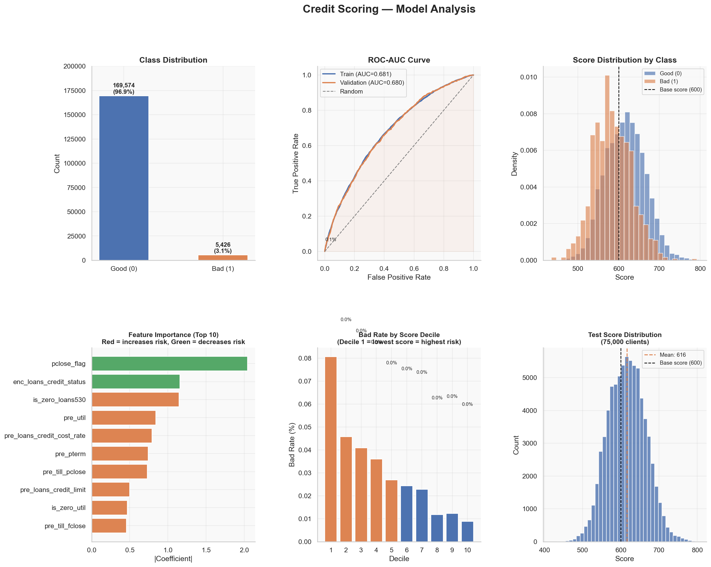

# Credit Scoring: WoE Binning and Logistic Regression

> Binary classification model predicting client default probability, built as a production-style scorecard.

[](https://python.org)
[](LICENSE)

## Results

| Metric | Validation |
|--------|-----------|
| AUC-ROC | **0.68** |
| Gini coefficient | **0.36** |
| KS statistic | **0.26** |
| Score range | **415 — 805** |


## What this project does

Standard credit scoring pipeline used in real banking applications:

1. **EDA**: class imbalance analysis, missing values, constant feature removal
2. **WoE binning**: transforms each feature into log-odds bins via `optbinning` (fit on train only, no leakage)
3. **Logistic Regression**: trained on WoE-transformed features with balanced class weights
4. **Scorecard**: converts model output to interpretable integer scores using PDO=50, base score=600
5. **Evaluation**: AUC, Gini, KS-statistic, score band analysis by decile

The scorecard formula:
```
Score = Offset - Factor * log(odds)
```
where `Factor = PDO / ln(2)`, `Offset = 600 - Factor * intercept`.
**Higher score = better (lower-risk) client.**

## Dataset

| Split | Rows | Features | Target |
|-------|------|----------|--------|
| Train | 175,000 | 60 | `flag` (1 = default) |
| Test | 75,000 | 60 | — |

Bad rate: ~3.1% (imbalanced — handled via `class_weight='balanced'`)

## Project structure

```
credit-scoring/
├── credit_scoring.ipynb    # main notebook (10 sections)
├── data
├── scoring_results_final.csv
├── requirements.txt
├── .gitignore
└── README.md
```

## Quick start

```bash
git clone https://github.com/assiyabaubekova/credit-scoring.git
cd credit-scoring

pip install -r requirements.txt

# place data files in data/
jupyter notebook credit_scoring.ipynb
```

---

## Key dependencies

| Package | Purpose |
|---------|---------|
| `optbinning` | WoE binning and scorecard utilities |
| `scikit-learn` | Logistic Regression, metrics |
| `pandas` / `numpy` | Data manipulation |
| `matplotlib` / `seaborn` | Visualization |

## Visualizations

